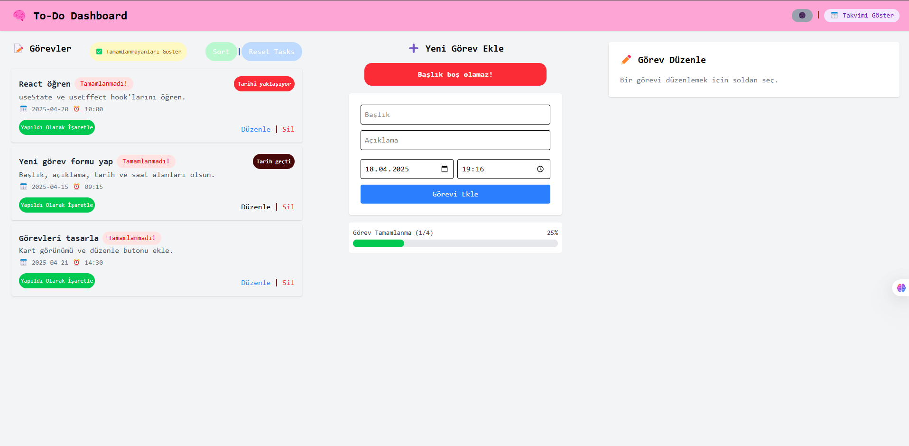

# 🧠 Kendine Not – React To-Do Dashboard

Kendi görevlerini düzenli tutmak ve üretkenliğini artırmak için geliştirilen gelişmiş bir görev yönetim uygulamasıdır. Modern tasarım, pratik özellikler ve kullanıcı dostu arayüz bir arada!

## 🚀 Özellikler

- ✅ Görev ekleme, düzenleme ve silme
- 📆 Takvim görünümü ile tarih bazlı takip
- 🌙 Karanlık/Aydınlık tema desteği
- 🔄 Sürükle-bırak ile görev sıralama (`react-beautiful-dnd`)
- 📤 Görevleri JSON formatında dışa aktarma
- 📥 Hatalı girişlerde uyarı sistemleri
- 📊 Görev tamamlama oranı göstergesi
- 🔍 Tamamlananları filtreleme ve görsel rozetler
- ✨ (Geliştirilebilir: Etiket, tekrar eden görev, bildirim, vs.)

## 🛠️ Kullanılan Teknolojiler

- React (Hooks, Context API)
- Tailwind CSS
- react-router-dom
- react-beautiful-dnd
- html2pdf.js (opsiyonel)
- localStorage (veri saklama)

## 🖼 Ekran Görüntüleri

### 🌞 Gündüz Modu


### 🌙 Gece Modu


### ➕ Görev Ekleme


### 📊 İlerleme Çubuğu


## 🧪 Kurulum
> Zip indir kur npm i komutu kullan ve npm run dev ile devam et.
```bash
git clone https://github.com/kullaniciadi/kendine-not.git
cd kendine-not
npm install
npm run dev
